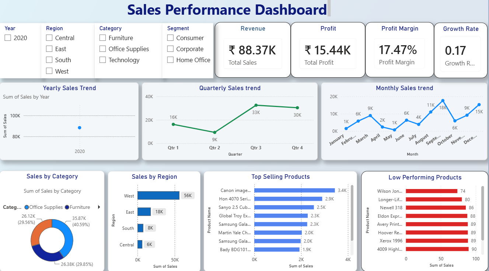

# 📊 Sales Performance Dashboard | Power BI



## 📌 Project Overview

This project presents an interactive **Sales Performance Dashboard** built using **Microsoft Power BI**. The dashboard transforms raw sales data into meaningful business insights by analyzing revenue, profit, product performance, customer behavior, and regional sales trends.

It enables users to monitor key business metrics, identify high-performing products, compare regional performance, and explore sales trends through interactive filters.

---

## 🎯 Objectives

- Import and clean the raw sales dataset.
- Remove missing values and duplicate records.
- Analyze monthly, quarterly, and yearly sales trends.
- Identify top-selling and low-performing products.
- Compare sales across different regions and categories.
- Build KPI cards for business performance monitoring.
- Create an interactive dashboard using Power BI.

---

## 🛠️ Tools & Technologies

- Microsoft Power BI
- Power Query
- DAX (Data Analysis Expressions)
- Microsoft Excel

---

## 📂 Dataset

**Dataset Used**

- SuperStore Sales Dataset

---

## 📈 Dashboard Features

### KPI Cards
- 💰 Total Revenue
- 📈 Total Profit
- 📊 Profit Margin
- 📉 Growth Rate

### Sales Trends
- Monthly Sales Trend
- Quarterly Sales Trend
- Yearly Sales Trend

### Product Analysis
- Top Selling Products
- Low Performing Products

### Business Analysis
- Sales by Category
- Sales by Region

### Interactive Filters
- Year
- Region
- Category
- Segment

---

## 📷 Dashboard Preview


---

## 📊 Key Insights

- Office Supplies generated the highest sales among product categories.
- The West region contributed the highest revenue.
- Monthly sales peaked during the later months of the year.
- The dashboard highlights both the top-selling and lowest-performing products for better decision-making.
- Interactive slicers allow users to filter data by Year, Region, Category, and Segment.

---

## 📁 Project Structure

```
Sales-Performance-Dashboard-PowerBI
│
├── README.md
├── Sales_Performance_Dashboard.pbix
│
├── SuperStore Sales DataSet.xlsx
│
└── dashboard.png
```

---

## 🚀 How to Use

1. Download the repository.
2. Open the `.pbix` file using Microsoft Power BI Desktop.
3. Refresh the dataset if required.
4. Explore the dashboard using the interactive filters.

---

## 📌 Skills Demonstrated

- Data Cleaning
- Data Transformation
- Data Visualization
- Dashboard Design
- DAX Measures
- Business Intelligence
- KPI Development
- Sales Analytics

---

## 👨‍💻 Author

**Shaik Ismail Jabiullah**

- LinkedIn: https://www.linkedin.com/in/shaik-ismail-jabiullah-87294b408
- GitHub: https://github.com/ismail-7-s

---

## ⭐ If you found this project useful, consider giving it a star!
